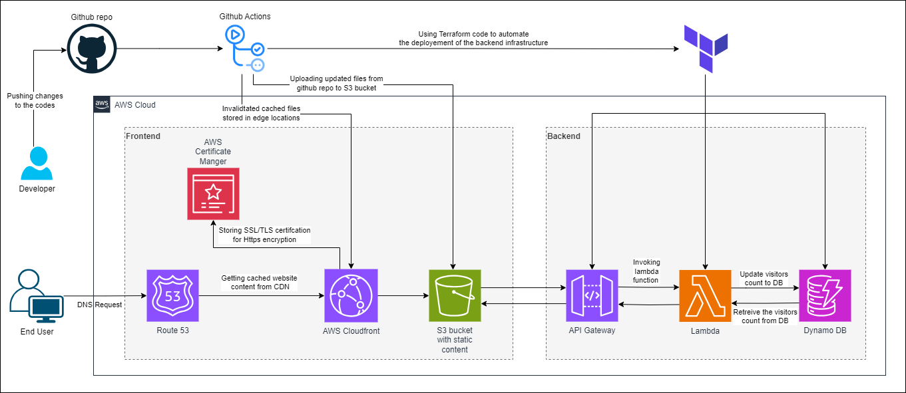

# The Cloud Resume Challenge (AWS)
## About The Project
This is my Cloud Resume Challenge built on AWS. It's a static website hosted on AWS S3 bucket, with a visitor counter built on AWS Lambda functions. The website is built with HTML, CSS, and JavaScript. The visitor counter is built with Python and AWS lambda functions. 

## Structure

- `.github/workflows/`: Folder contains CI/CD workflow configurations.
- `resume/`: Folder contains the website.

- `infra/`: Folder contains the infrastructure codes.
    - `lambda/lambda_function.py`: Contains the visitor counter code which is deployed on lambda function.
    - `main.tf`: Contains the backend infrastructure written as terraform code.

## AWS Services Used
- Route 53
- Cloudfront
- S3 bucket
- Certificate Manager
- Lambda function
- API Gateway
- Dynamo DB
  
## Documentation
I’ve written a detailed blog post about the project and my learnings:  
[Read the blog here](https://medium.com/@steveyadav.2002newdelhi/how-i-built-my-cloud-resume-challenge-on-aws-with-terraform-ci-cd-and-a-serverless-visitor-f64cf7a5414d)
